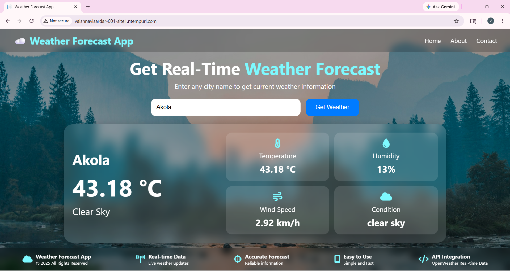

# Weather Forecasting ASP.NET Project

## Description
This is a weather forecasting web application developed using ASP.NET.

## Technologies Used
- ASP.NET
- C#
- SQL Server
- HTML
- CSS
- Bootstrap

## Features
- Weather Forecast
- Temperature Details
- City Search
- Responsive Design

## Live Website
http://vaishnavisardar-001-site1.ntempurl.com

## GitHub Repository
https://github.com/VaishnaviSardar24/WeatherForeCastApp.git

## Project Screenshot

